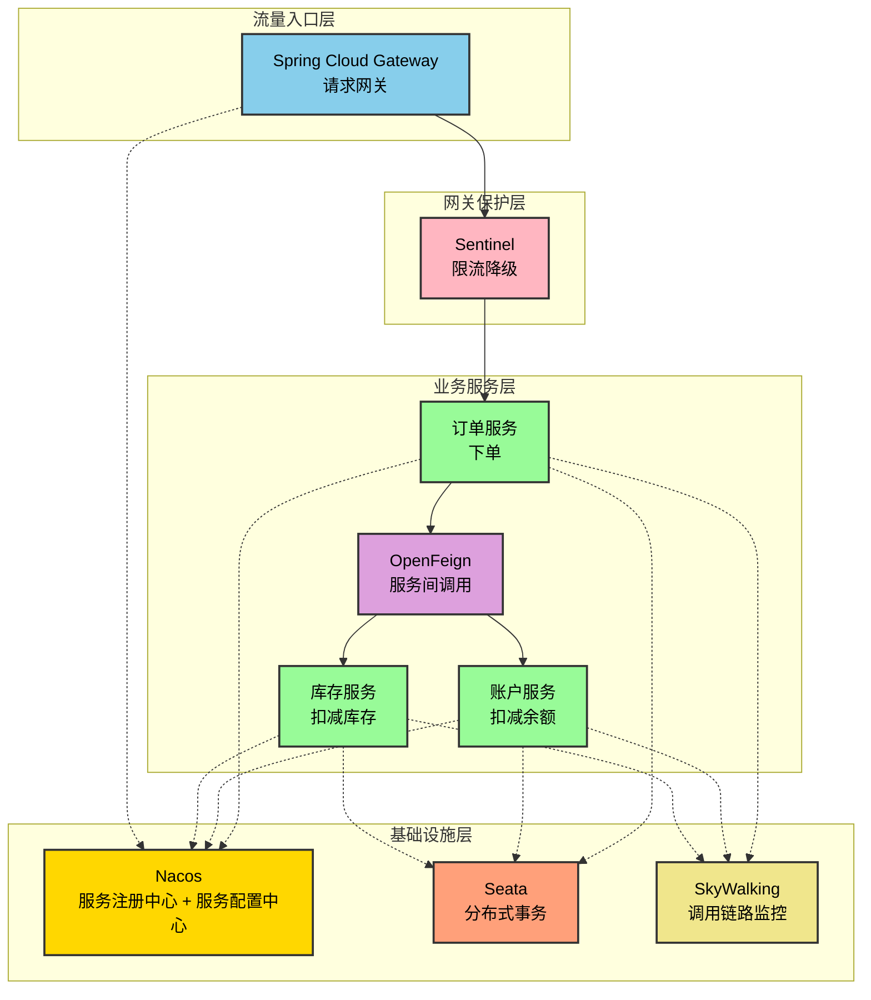

# spring-cloud-alibaba-2023-demo

## 1. 项目介绍

该项目使用一个短小精悍的MVP演示Spring Cloud Alibaba的使用，具有如下特点

- **快速上手**：项目完整、短小精悍、涵盖微服务核心组件、避免内容碎片化。
- **快速实践**：基于[官网](https://sca.aliyun.com/docs/2023/overview/version-explain/) 上最新的 Spring Cloud Alibaba 2023.x.0，展示快速可部署的微服务应用雏形。
- **可扩展性**：项目架构灵活，可根据实际业务需求修改适配。

它覆盖如下中间件：

| 中间件                  | 用途              |
| -------------------- | --------------- |
| Nacos                | 注册中心（服务发现，配置托管） |
| OpenFeign            | 调用封装、负载均衡       |
| Sentinel             | 限流、熔断降级         |
| Spring Cloud Gateway | 微服务网关           |
| Seata                | 分布式事务           |
| Skywalking           | 服务链路追踪          |

MVP是经典的Demo场景。它模拟一个下单场景，由订单服务（用户下单）通过微服务中间件来调用库存服务（扣减库存）、账户服务（扣减余额）。调用关系如下图，实线表示调用关系，虚线表示依赖关系。

## 2. 项目模块

这个repo中的各代码模块，与上图对应关系如下

| 代码模块                                                           | 图中对应的组件 |
|----------------------------------------------------------------|---------|
| [microservices/tlmall-gateway](microservices/tlmall-gateway) | 请求网关    |
| [microservices/tlmall-order](microservices/tlmall-order)     | 订单服务    |
| [microservices/tlmall-storag](microservices/tlmall-storage)  | 库存服务    |
| [microservices/tlmall-accoun](microservices/tlmall-accoun)   | 账户服务    |

另外还有两个代码模块，不在上图中

| 代码模块                                                        | 图中对应的组件   |
|----------------------------------------------------------------|-----------|
| [microservices/tlmall-frontend](microservices/tlmall-frontend) | 发起下单的网页界面 |
| [microservices/tlmall-common](microservices/tlmall-common)     | 公用代码      |

## 3. 中间件配置

`midwares/dev`用于构建开发环境，存放Nacos、Seata等中间件，修改后的配置文件、脚本等

| 代码模块                                     | 图中对应的组件                    |
|---------------------------------------------|--------------------------------|
| [midwares/dev/local](midwares/dev/local)    | 各个中间件本地配置文件             |
| [midwares/dev/remote](midwares/dev/remote)  | 各个中间件托管在Nacos的远程配置文件  |

